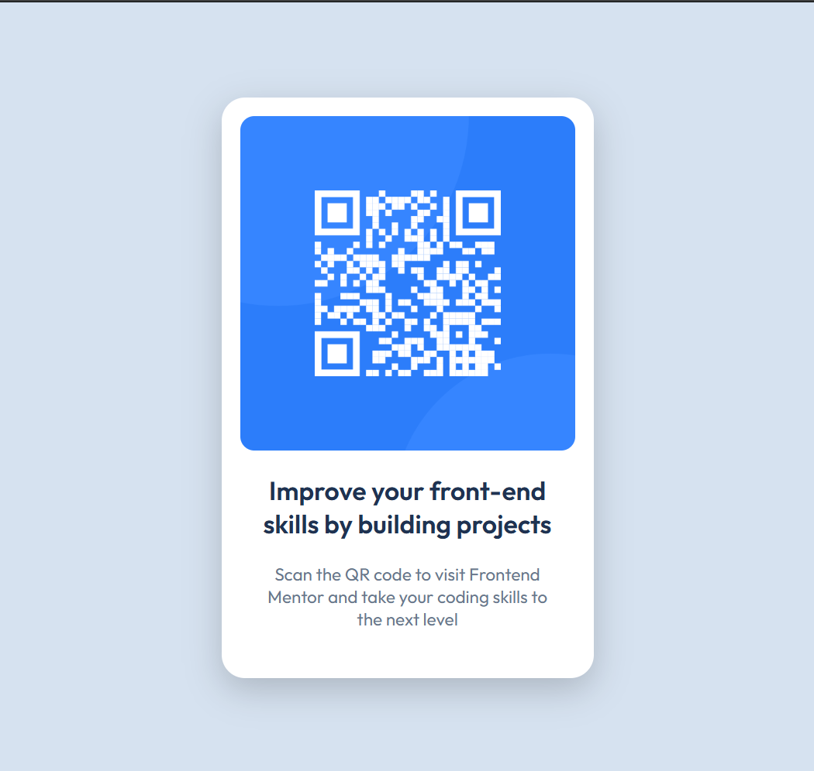

<<<<<<< HEAD
# QR Code Component

Solución al reto [QR Code Component](https://www.frontendmentor.io/challenges/qr-code-component-iux_sIO_H) de Frontend Mentor.

## Vista previa

## Construido con

- HTML5 semántico
- CSS personalizado
- Flexbox
- Mobile-first

## Lo que aprendí

- La diferencia entre `<figure>` y `
` para imágenes semánticas
- Cómo cargar correctamente Google Fonts con `preconnect`
- Cuándo usar `rem` vs `px` según el tipo de propiedad
- Conventional Commits para mensajes de git

## Autor

- Frontend Mentor: [@Calceto23](https://www.frontendmentor.io/profile/Calceto23)
- GitHub: [@Calceto23](https://github.com/Calceto23)
=======
# proyectos-aprendizaje
Espacio para guardar mis primeros proyectos de práctica.
>>>>>>> 7a10e1b9d1806b67d3d2a7e278500e0c344a1bd1
